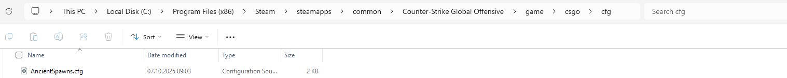
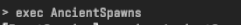

# 🧨 CS2 Insta Smokes Config

## 🎯 Overview
This is a **Counter-Strike 2 Insta Smokes configuration** that lets you instantly teleport to preset positions and view angles to practice grenade lineups — no need to manually move or aim each time.

You can quickly switch between saved smoke spots using console aliases or keybinds.  
Perfect for training utility lineups or creating workshop smoke videos.

---

## 🧰 Features
- 🔹 Instantly **teleport** between lineup spots
- 🔹 Cycle through smokes using `Next` / `Prev` binds
- 🔹 Fully **client-side**, no server required
- 🔹 Currently only works on ancient but it ought to be updated in the near future.

---

## 📂 How to use?
1. Download the [AncientSpawns.cfg](AncientSpawns.cfg)
2. Find your game files and paste it into Steam>steamapps>common>Counter-Strike Global Offensive>game>cs>cfg:



3. When you want to use that config just open the console in cs2 and type ``` exec AncientSpawns ```
like show in image below:



4. Use **PageUp** and **PageDown** to switch between spawns
